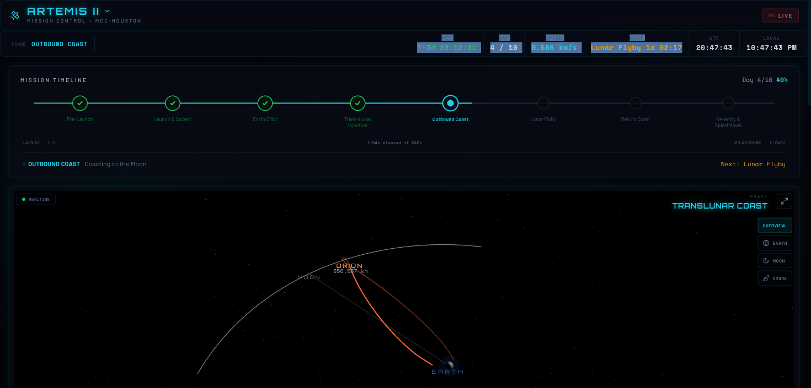
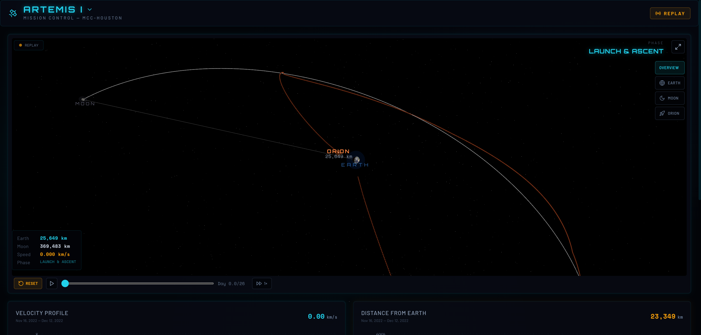

# Artemis Mission Tracker

Real-time 3D mission dashboard tracking NASA's Artemis lunar program. Built with React, Three.js, and live data from JPL Horizons.

**[Live Demo](https://mango-plant-0a0b9ee03.6.azurestaticapps.net/)**





## Features

- **3D Trajectory Visualization** — Real-time Orion spacecraft position with Earth, Moon, and flight path rendered in WebGL
- **Multi-Mission Support** — Switch between Artemis I (historical replay) and Artemis II (live tracking)
- **JPL Horizons Data** — Spacecraft ephemeris from NASA/JPL (SPKID -1023, -1024), EME2000 frame
- **Mission Timeline** — Visual phase tracker with real-time progress
- **Live Telemetry** — Velocity, distance, and trajectory metrics
- **Space Weather** — Kp index, solar wind, and IMF data from NOAA SWPC
- **Deep Space Network** — Live DSN dish status from NASA DSN Now
- **NASA Live Feeds** — Embedded YouTube streams for mission coverage
- **Replay Mode** — Scrub through completed missions with play/pause and speed controls (1x to 36,000x)

## Tech Stack

| Layer | Technology |
|-------|-----------|
| Frontend | React 19, TypeScript, Vite |
| 3D Engine | Three.js, React Three Fiber, Drei |
| Styling | Tailwind CSS 4 |
| Charts | Recharts |
| Data | JPL Horizons API, NOAA SWPC, NASA DSN Now |
| API | Azure Functions (Node.js) |
| Hosting | Azure Static Web Apps |

## Local Development

```bash
npm install && cd api && npm install && cd ..
npm run dev
```

Starts Vite on `localhost:5173` and Azure Functions on `localhost:7071`. Requires [Azure Functions Core Tools v4+](https://learn.microsoft.com/en-us/azure/azure-functions/functions-run-local).

## Project Structure

```
src/
├── components/       # React components (TrajectoryMap, Header, charts, etc.)
├── data/
│   ├── trajectoryData.ts   # Multi-mission trajectory engine
│   └── artemisIData.ts     # Artemis I ephemeris (304 points from JPL Horizons)
├── lib/              # API hooks, types, utilities
└── App.tsx           # Dashboard layout and mission switching
api/
└── src/functions/    # Azure Functions (trajectory, weather, DSN, etc.)
```

## License

MIT
